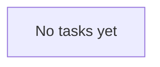

# NOW.md — Current State

> Dynamic file. Update often. See `CLAUDE.md` for stable info.

**Last Updated:** [Date]

---

# QUEUE

> Live tasks. Add `[deps:task]` for dependencies.

- (empty)

---

# TASK GRAPH

> Auto-updated dependency visualization.

---

# THIS WEEK

## Active Missions
1. **[MISSION]** — [One-line description]

## Actions

| Action | Deadline | Status |
|--------|----------|--------|
| [Specific action] | [Date] | pending |

**MIT Today:** [Your one thing for today]

---

# LOG

## Memory (AI Notes)

This is where Claude tracks patterns, insights, and breakthroughs over time.

### [Date]
- [Key insight or pattern observed]
- Quote: *'your exact words'*

---
