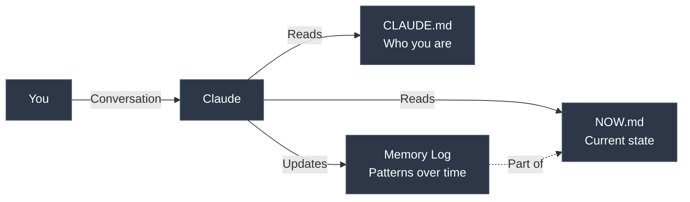

# Claude Life Assistant

A personal coach that remembers, notices patterns, and holds you accountable.

<a href="https://www.youtube.com/watch?v=cY3LvkB1EQM"></a>
    
[Watch the video](https://www.youtube.com/watch?v=cY3LvkB1EQM)

## What This Is

A 2-file system that gives Claude:
- **Memory** — Builds a log of insights about you over time
- **Context** — Stable identity (CLAUDE.md) + dynamic state (NOW.md)
- **Accountability** — Daily check-ins with pattern recognition

**The key difference:** Claude notices what you can't see. The Memory Log tracks breakthroughs, quotes, and patterns across weeks/months.

## How It Works



**The Philosophy:** Trust through transparency. All memory lives in files you control. Claude builds context over time, you see everything it remembers.

## Installation

### Option 1: Clone (Recommended)

```bash
git clone https://github.com/lout33/claude_life_assistant
cd claude_life_assistant
```

Then open with Claude Code and run `/setup-life`.

### Option 2: Include in Existing Project

Copy `CLAUDE.md` and `NOW.md` templates into your project root. Claude will read them automatically.

## Global Installation (Use Across All Projects)

Want to use Claude Life Assistant across all your projects without committing personal files to each repo?

**Claude Code users** — Your `~/.claude/` folder already exists. Just copy files:

```bash
cp CLAUDE.md NOW.md ~/.claude/
mkdir -p ~/.claude/commands
cp -r .claude/commands/* ~/.claude/commands/
```

**OpenCode users** — Your `~/.config/opencode/` folder exists. Just copy files:

```bash
cp CLAUDE.md ~/.config/opencode/AGENTS.md
cp NOW.md ~/.config/opencode/
mkdir -p ~/.config/opencode/command
cp -r .claude/commands/* ~/.config/opencode/command/
```

**Other AI agents** — Most look for instruction files in project root or global config. Check your tool's docs and place files there.

## Quick Start

Run `/setup-life` to create your 2-file system. Takes 5 minutes.

Then use:
- `/start-day` — Morning kickoff
- `/check-day` — Quick check-in
- `/end-day` — Evening review + Memory Log update

## The 2-File System

| File | Updates | Purpose |
|------|---------|---------|
| `CLAUDE.md` | Rarely (weeks/months) | Who you are, how you work, your mission |
| `NOW.md` | Daily/weekly | Current mode, this week's actions, Memory Log |
| `journal/` | Daily | What happened each day (auto-created) |

**Why 2 files?**

Separation = clarity. CLAUDE.md is your operating system. NOW.md is your current state. Claude reads both at session start, updates NOW.md as you work.

**Conversation > Documentation**

You talk to Claude. Claude maintains the files. No manual file editing required.

## How It Works (Data Flow)

**Local:**
- All your files (`CLAUDE.md`, `NOW.md`, journal) are stored on your machine
- You own and control all data
- Safe to version control (but consider `.gitignore` for personal files)

**Cloud:**
- Conversations are processed through your AI provider's API (Anthropic, OpenAI, etc.)
- API usage costs apply based on your provider's pricing
- Your provider's privacy policy applies to conversation data

**Want full privacy?** This file-based system works with any LLM. For local-only processing, use with Ollama or LM Studio (setup instructions coming soon).

## The Memory Log (Secret Sauce)

In `NOW.md`, Claude maintains a dated log:
- Patterns it notices over time
- Your exact words (quoted)
- Breakthroughs and insights
- Connections across conversations

**This is what makes it different from a journal.** Claude sees patterns you miss.

Example progression:
```
### Week 1, Jan 7
- Setup complete. Known bug: 'I keep adding features instead of launching'

### Week 1, Jan 10
- Avoided user call. Rescheduled twice. Pattern: building = safe, talking = scary.

### Week 2, Jan 15
- Had first user call. Quote: 'I've been building what I think they want instead of asking'

### Week 4, Feb 1
- Pattern confirmed: 3 weeks of work on feature nobody asked for. This is the 3rd time.
```

The longer you use it, the better it gets.

## The Commands

### `/setup-life`
**Run this first.** Creates both CLAUDE.md and NOW.md through a 5-minute conversation.

<details>
<summary>See example setup</summary>

**You:** /setup-life

**Claude:** Let's set up your system. I'll ask a few questions.

First — what should I call you?

**You:** Alex

**Claude:** What are you working toward right now?

**You:** I quit my job 2 months ago to build a SaaS product. Have about 4 months of runway left.

**Claude:** What usually gets in your way?

**You:** I keep adding features instead of launching. And I avoid talking to users because it's awkward.

**Claude:** When you're off track, how should I call you out?

**You:** Be direct. I need someone to cut through my BS.

**Claude:** What modes do you operate in? Like BUILDER (shipping code), STRATEGIST (planning), HUMAN (rest).

**You:** BUILDER when I'm shipping, BROWSER when I'm procrastinating on Reddit, HUMAN when recovering.

**Claude:** What are your 2-3 active missions right now?

**You:** Launch MVP by Feb 15. Get 10 paying users by Mar 31.

**Claude:** Got it. Files created. What's your one thing for today?

**You:** Ship the signup flow.

**Claude:** Good. Ship the signup flow. 120 days to Mar 31.

Go.

</details>

### `/start-day`
Morning ritual. Sets your MIT (Most Important Thing) for the day.

### `/check-day`
Quick check-in. Claude mirrors what you're doing vs what you said you'd do.

### `/end-day`
Evening review. Updates Memory Log with what happened and patterns observed.

## Examples

Check `examples/` for real progressions:
- **alex-founder** — Solo founder building SaaS, racing against runway
- **maya-creator** — Marketing manager building content side hustle
- **rick-developer** — Backend dev job hunting after layoff
- **sam-student** — Career changer learning to code part-time

Each shows Week 1 → Month 3 evolution with Memory Log progression.

## Philosophy

**Conversation > Documentation** — You talk, Claude maintains files

**Memory compounds** — The longer you use it, the better it gets

**Ship ugly** — Done beats perfect

**One thing** — Every day has one MIT. Everything else is secondary.

## Advanced: Full Life OS

This template covers the basics. My personal setup includes:

- **Skills ecosystem** — Search, research, image generation, and more
- **Agent delegation** — Spawn sub-agents for complex tasks
- **Integrated journal** — Daily entries with AI pattern recognition
- **Custom commands** — Rituals for `/start-day`, `/check-day`, `/end-day`

Interested in the full system? **Let me know** (feedback helps prioritize what to build next).

## Requirements

- Claude Code CLI (or any Claude interface that supports custom instructions)
- A folder for your life system

## Credits

Created by [@lout33](https://github.com/lout33)

Inspired by the belief that AI should help you become more yourself, not less.

---

*"The solution isn't a better system. It's doing the uncomfortable thing you're avoiding."*

---


## Star History

[](https://star-history.com/#lout33/claude_life_assistant&Date)
