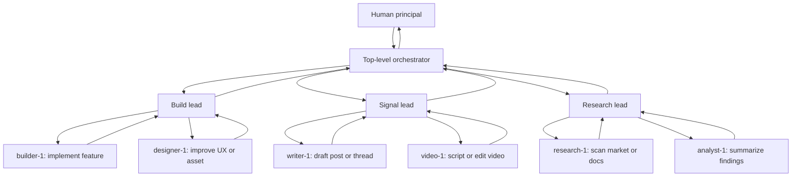
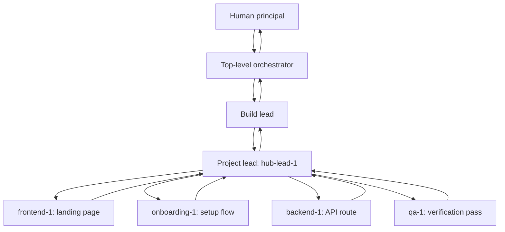
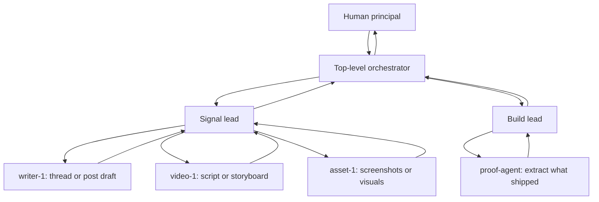
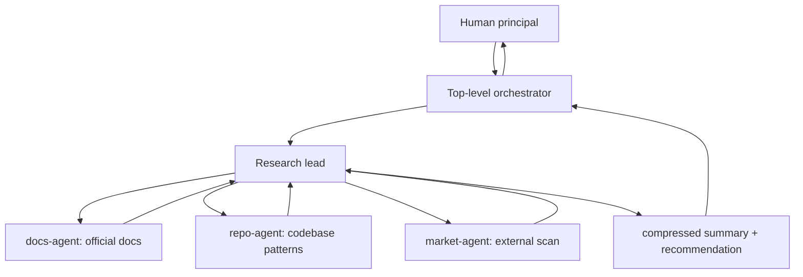

# Multi-Agent Hierarchy Guide

One human can work well with one agent. Beyond that, a flat swarm gets noisy fast. This guide shows the simple pattern: keep one top-level orchestrator between you and the rest of the agents.

## When to Use This

Use a multi-agent hierarchy when:

- one agent is no longer enough to handle your active work
- you want parallel execution without reading everything yourself
- different work lanes need different specialists
- you want to keep strategy separate from execution

Do **not** use this when one agent can still handle the work clearly. Start simple. Add layers only when the work justifies them.

## The Core Idea

Do not manage ten agents directly.

Manage one top-level orchestrator.

That orchestrator manages leads.
Leads manage specialists.
Specialists do bounded execution and return artifacts upward.

The hierarchy looks like this:

```text
Human
  -> Top-level orchestrator
    -> Lead agents
      -> Specialist agents
```

The point is not complexity. The point is control.

## The Layers

| Layer | Job | Scope | Typical Outputs |
|------|-----|-------|-----------------|
| Human principal | decide what matters, approve direction, make send/kill decisions | whole system | priorities, constraints, taste, final judgment |
| Top-level orchestrator | translate goals into fronts, weekly plans, and spawn decisions | all active work | active missions, review queue, control rules |
| Lead agents | coordinate one front or one project | one front or one project | mission briefs, summaries, kill/continue recommendations |
| Specialist agents | execute one bounded mission | one task only | code, docs, research, assets, reports |

## What Each Layer Should Do

### Human principal

The human should stay at the top.

Your job is to:

- decide what matters now
- choose the main lane
- approve pivots
- make spend, send, publish, and kill decisions
- provide taste, context, and constraints

Your job is **not** to micromanage every specialist.

### Top-level orchestrator

This is the agent you talk to most.

Its job is to:

- turn your goals into active fronts or projects
- decide when to spawn, pause, or kill agents
- compress outputs before they reach you
- protect the main lane from turning into chaos
- surface only the decisions that require human judgment

This layer is the command chain, not just another worker.

### Lead agents

Leads sit in the middle.

Use them when one work lane has enough repeated activity to deserve its own coordination.

Examples:

- one lead for `Build`
- one lead for `Signal`
- one lead for `Research`
- one lead for a large project with many moving parts

Their job is to:

- understand one domain deeply
- break the work into missions
- coordinate specialists inside that scope
- return summaries upward instead of raw noise

### Specialist agents

Specialists should be narrow.

Their job is to:

- execute one bounded mission
- produce one artifact
- return clearly when done or blocked

Good specialist missions:

- write one benchmark report
- build one UI component
- draft one outreach asset
- research one market question

Bad specialist missions:

- "figure out the whole strategy"
- "own this whole business"
- "manage other specialists"

## Default Operating Shape

Start here:

```text
You
  -> Top-level orchestrator
    -> Build lead
    -> Signal lead
    -> Research lead
    -> one or two specialists under each only when needed
```

In many cases, that is enough.

Add a project lead only when one project gets heavy enough to need its own middle layer.

## Command Flow

The clean flow is:

```text
Human -> Top-level orchestrator -> Lead -> Specialist
Specialist -> Lead -> Top-level orchestrator -> Human
```

In practice:

1. the human says what matters now
2. the top-level orchestrator translates that into fronts, projects, and missions
3. leads break the work into bounded tasks
4. specialists execute and return artifacts
5. leads compress outputs into decisions or summaries
6. the top-level orchestrator surfaces only what needs human judgment

## Review Flow

Use review compression or the human becomes the bottleneck.

Recommended cadence:

- morning: what is active?
- midday: what needs a decision?
- evening: what shipped, what died, what continues tomorrow?

Leads should review specialists after each mission ends, when blocked, or when outputs conflict.

## Spawn Rules

- spawn leads for stable work lanes, not for every tiny task
- spawn project leads only when a project is large enough to need repeated coordination
- spawn specialists for one bounded mission at a time
- keep total swarm size small enough that the top-level orchestrator can still maintain clarity

## Kill Rules

- kill a specialist mission if the output is vague, redundant, or not tied to a decision
- pause a lead if that lane has no active goal
- kill a whole lane if it produces no proof after a real test
- if a lower layer starts doing portfolio strategy, the hierarchy is broken

## Common Failure Modes

| Failure | What it looks like | Fix |
|---------|--------------------|-----|
| Flat swarm chaos | the human talks to too many agents directly | route communication through one top-level orchestrator |
| Strategy leakage downward | specialists start redefining goals | move strategic decisions back up the hierarchy |
| Reading bottleneck | the human must read every raw output | require leads to compress and summarize |
| Layer inflation | too many leads for too little work | remove layers until the system is simple again |
| Meta drift | the system spends all week improving itself | tie each lane to a real outcome or kill it |

## Example Use Cases

Below are a few concrete ways to use the hierarchy.

### 1. Weekly operating system

Use this when you have a few stable work lanes and want one orchestrator to keep the whole week coherent.



In this version:

- the human does not talk to all specialists
- each lead owns one lane
- the orchestrator decides what deserves attention at the top

### 2. One large project with a project lead

Use this when one project becomes too heavy to manage through a front lead alone.



In this version:

- the build lead stays responsible for the front
- the project lead owns local coordination inside the project
- specialists stay narrow and do not redefine the project

### 3. Content pipeline around one flagship project

Use this when you want to turn one project into repeated public signal.



In this version:

- Build turns work into proof
- Signal turns proof into posts, videos, and assets
- the human only steps in for taste, face, voice, and final publish decisions

### 4. Research and decision compression

Use this when many questions need answering, but the human should only see the final decision surface.



In this version:

- the human does not read every raw search result
- the lead compresses findings into one recommendation
- the orchestrator decides whether this changes current priorities

## Copy-Paste Starter Template

Use this as a starting point for your own hierarchy:

```md
# AGENT_LAYERS.md

## Core idea

- I talk to one top-level orchestrator.
- The orchestrator manages leads.
- Leads manage specialists.
- Specialists execute bounded work and return artifacts upward.

## Human principal

- owner: <your name>
- job: decide what matters, approve direction, make final send/kill decisions

## Top-level orchestrator

- owner: <main session agent name>
- job: translate goals into fronts, plans, missions, and spawn decisions

## Active leads

- build-lead-1 -> product and implementation
- signal-lead-1 -> content and publishing
- sense-lead-1 -> research and scanning

## Specialist rule

- each specialist does one bounded mission at a time
- specialists do execution, not portfolio strategy

## Review flow

- morning: what is active?
- midday: what needs a decision?
- evening: what shipped, what continues, what dies?

## Kill rules

- kill vague work
- kill redundant work
- kill lanes that produce no proof
```

## The Point

The point of a multi-agent hierarchy is simple:

- broad thinking goes up
- coordination stays in the middle
- narrow execution goes down

One human should not manage a flat swarm.
One human should manage a command chain.
